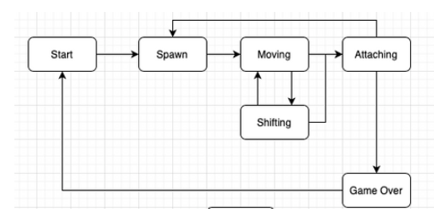

# Tetris
Implementation the game "Tetris" in the C programming language.


To formalize the logic of this game, the following variant of a finite-state machine was used:



This FSM has the following states:
- Start is the state in which the game waits for the player to press the ready to play button.
- Spawn is the state the game enters when you create another block and choose the next block to spawn.
- Moving is the main game state with user input processing - rotating blocks/moving blocks horizontally.
- Shifting is the state the game enters after the timer expires. It moves the current block down one level.
- Attaching is the state the game enters after the current block "touches" the already fallen blocks or the ground. If filled rows are created, it is destroyed and the rest of the blocks are shifted down. If a block is stopped in the topmost row, the game enters the "game over" state.
- Game over is a game over.

Pieces used:


The following mechanics have also been added to the game:
- scoring
- storing maximum points
- a level mechanic that increases the speed of falling pieces with a new level

## Run Locally

1. Clone the project

```bash
  git clone https://github.com/nknL1/Tetris.git
```

2. Go to the project directory

```bash
  cd Tetris
```

3. Go to the src folder

```bash
  cd src
```

4. Run make for build

```bash
  make all
```
5. Go to the build folder

```bash
  cd build
```

6. Run tetris

```bash
  ./tetris
```